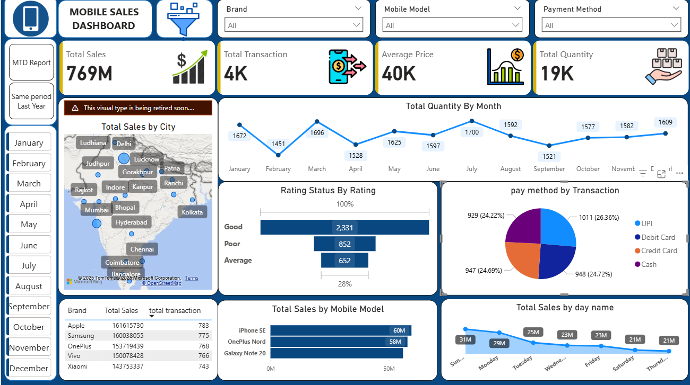
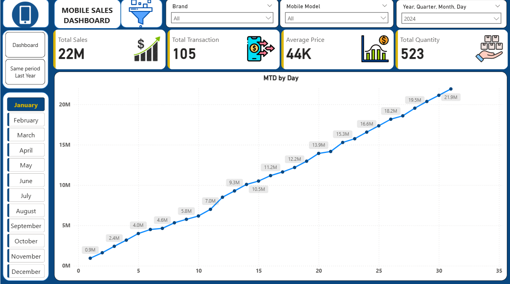
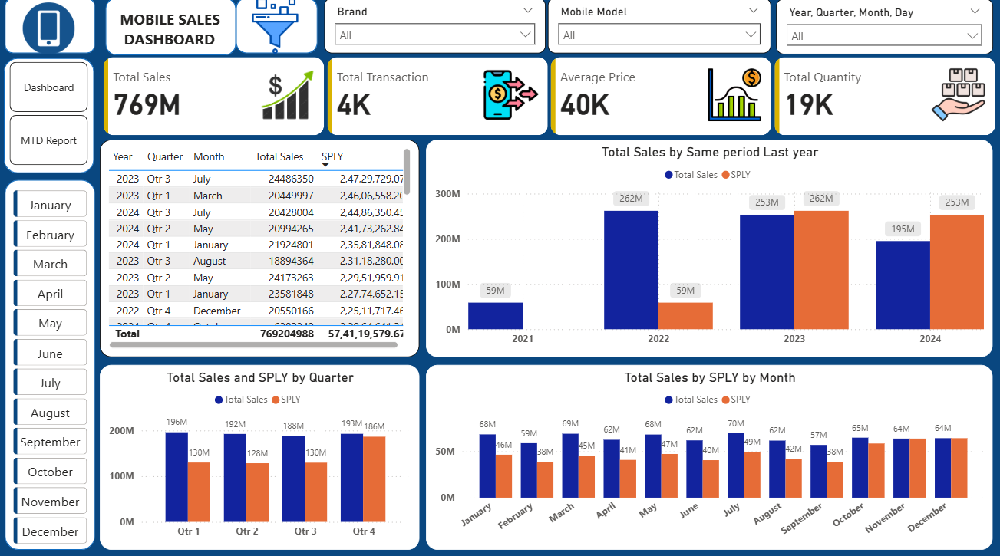

# 📊 Retail Mobile Sales Dashboard (Power BI + Excel)

                                                              ### DASHBORD
<p align="center">
  
</p>

                                                            ### MTD REPORT

<p align="center">
  
</p>

                                                        ### SAME PERIOD LAST YEAR

<p align="center">
  
</p>

---

## 🧠 Overview
This project presents an analysis of mobile sales across India from 2021 to 2024.  
The goal was to identify year-over-year trends, month-to-date performance, top cities, strong brands, and customer payment behaviour.  
The dashboard converts raw Excel data into clear insights that help retail teams make better decisions.

---

## ⚙️ Problem Statement
The retail team needed a consolidated view of long-term sales data to understand what drives performance across multiple years.  
Manual Excel analysis was inefficient, so a Power BI dashboard was created to provide a structured and interactive way to view trends, city contribution, brand performance, and customer behaviours

---

## 📦 Dataset Summary
| Feature | Description |
|--------|-------------|
| Duration | 2021–2024 |
| Total Transactions | 4,000+ |
| Total Quantity Sold | 19,000+ units |
| Total Sales | ₹769M |
| Average Selling Price | ₹40,000 |
| Data Source | Cleaned Excel dataset |
| Main Columns | Date, City, Brand, Model, Quantity, Price, Payment Method, Rating |
| Cleaning Performed | Removed missing values, normalized city names, formatted dates |
---
## 🧰 Tools and Technologies
- **Power BI Desktop** – Data modeling and dashboard creation  
- **Microsoft Excel** – Data cleaning and preprocessing  
- **DAX** – Measures for YoY, MTD, and growth calculations  

### 🔢 Core DAX Used
- `TOTALMTD()` – Month-to-Date calculation  
- `DATEADD()` – Same Period Last Year comparison  
- `CALCULATE()` – Filtered calculations  
- `DIVIDE()` – Safe division to avoid errors  

---

## 📈 Key Metrics (KPIs)
| KPI | Value |
|------|--------|
| Total Sales | ₹769M |
| Total Transactions | 4K |
| Average Selling Price | ₹40K |
| Quantity Sold | 19K units |
| YoY Growth | ~15% |
| Best Quarter | Q4 2022 |
| Best Month | March 2022 |
| Top Cities | Delhi, Mumbai, Ranchi |
| Top Brands | Apple, Samsung, OnePlus |
| Best Models | Vivo V20, Vivo S1, iPhone 11 |
| Dominant Payment Mode | UPI |
| Highest Monthly Transactions | March 2022 (Debit Card) |

---

## 📊 Dashboard Overview

### 📌 Page 1 – Executive Dashboard
- High-level KPIs  
- Year-over-Year growth using `DATEADD()`  
- Quarterly and monthly trend breakdown  
- Brand-level comparison

### 📌 Page 2 – Month-to-Date (MTD) Analysis
- Daily cumulative sales  
- Slicers for Year and Month  
- Month performance patterns using `TOTALMTD()`

### 📌 Page 3 – Deep Analysis
- City-wise sales on map  
- Payment method breakdown  
- Customer rating distribution  
- Brand and model performance

---

## 🔍 Key Insights
- Sales grew at an average of **15% YoY** across four years.  
- **March 2022** recorded the highest transactions and revenue.  
- **Delhi, Mumbai, Ranchi** generated the largest sales share.  
- **Apple, Samsung, OnePlus** were the most profitable brands.  
- **Vivo V20, Vivo S1, iPhone 11** were the most popular models.  
- UPI was the most preferred payment method overall.  
- About **72%** of customers rated their purchase as “Good.”

---

## 🧠 Results & Conclusion
The dashboard clearly highlights long-term performance, customer behaviour, and brand contribution.  
Key results show strong growth in 2022, high dependence on digital payments, and consistent contributions from metro cities.  
This dashboard is useful for strategic planning, pricing, and inventory decisions.

---

## 🚀 Future Improvements
- Include profit and discount columns for margin analysis  
- Add regional segmentation (North/South/East/West)  
- Automate data refresh with Power BI Gateway  
- Integrate online (e-commerce) sales data  
- Add forecasting using Power BI or Python 
 
---

## 🖥️ How to Run the Project
1. Clone or download the repository  
2. Open `Mobile_Sales_Dashboard.pbix` in Power BI Desktop  
3. Keep the Excel file `Mobile_Sales_Data.xlsx` in the correct folder  
4. Click Refresh to load data  
5. Use slicers for Year, Month, Brand, Model, Payment Mode
  
---

## 📁 Repository Structure

```
retail-mobile-sales-dashboard-pbi-excel/
│
├── dashboard/
│   └── Mobile_Sales_Dashboard.pbix
│
├── data/
│   └── Mobile_Sales_Data.xlsx
│
├── images/
│   ├── Dashboard_Page1.png
│   ├── MTD_Report_Page2.png
│   └── Deep_Analysis_Page3.png
│
└── README.md
```


---

## 👤 Author
**Name:** Sharik Ansari  
**Email:** sharikkha8900@gmail.com  
**LinkedIn:** https://www.linkedin.com/in/sharik-ansari-312021389?utm_source=share&utm_campaign=share_via&utm_content=profile&utm_medium=android_app  

---

## 🔖 Tags
#powerbi #dataanalytics #retailanalytics #salesanalysis #excel #businessintelligence #dashboarnce #DataVisu
